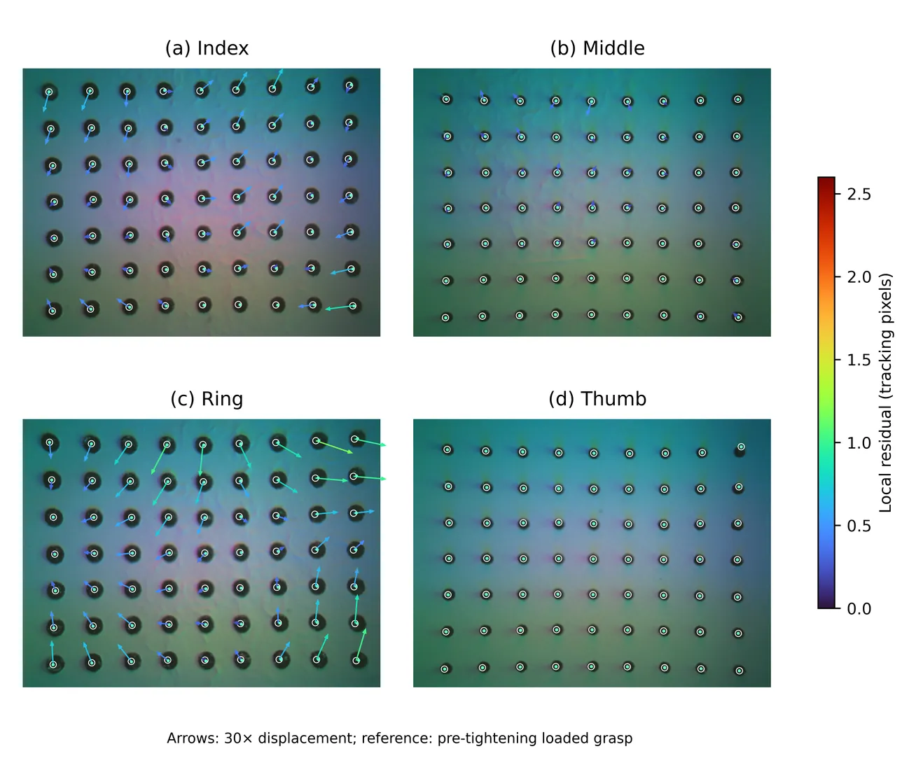
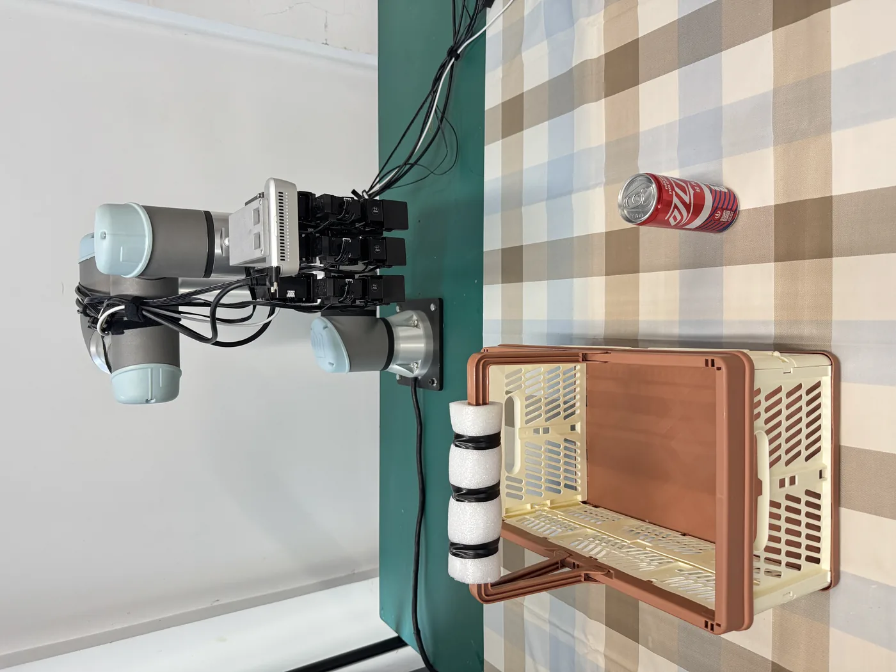
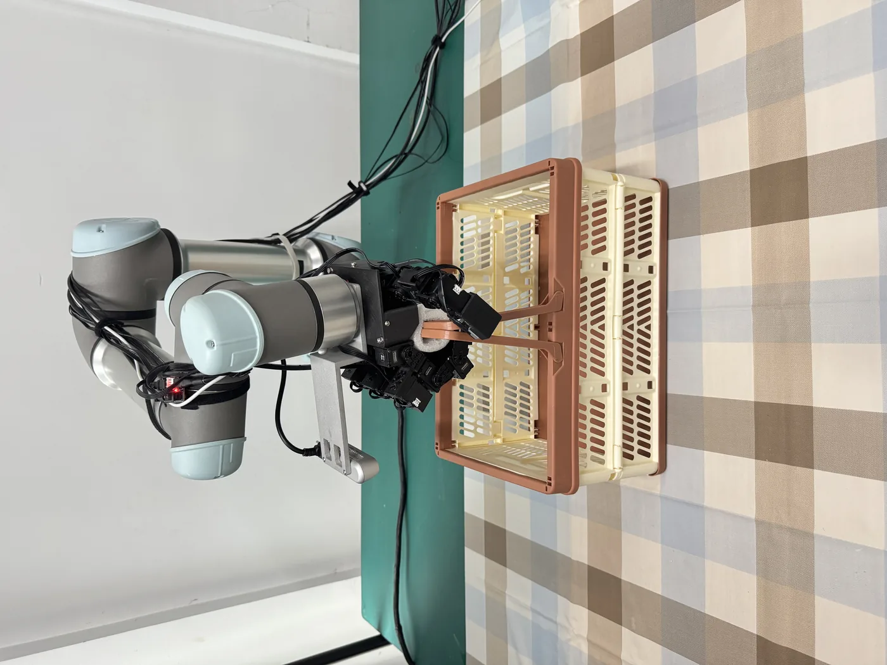
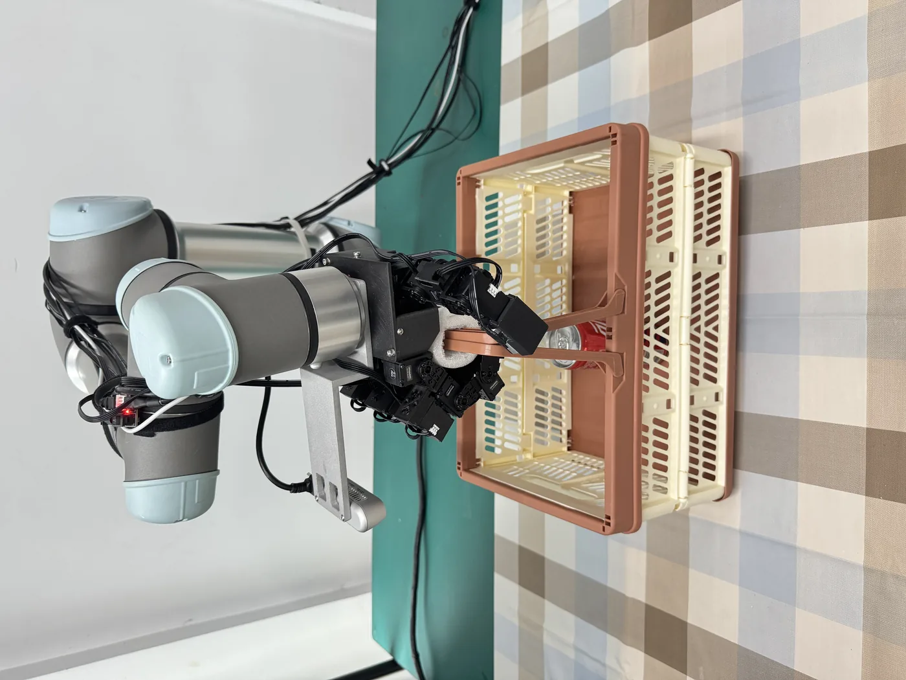
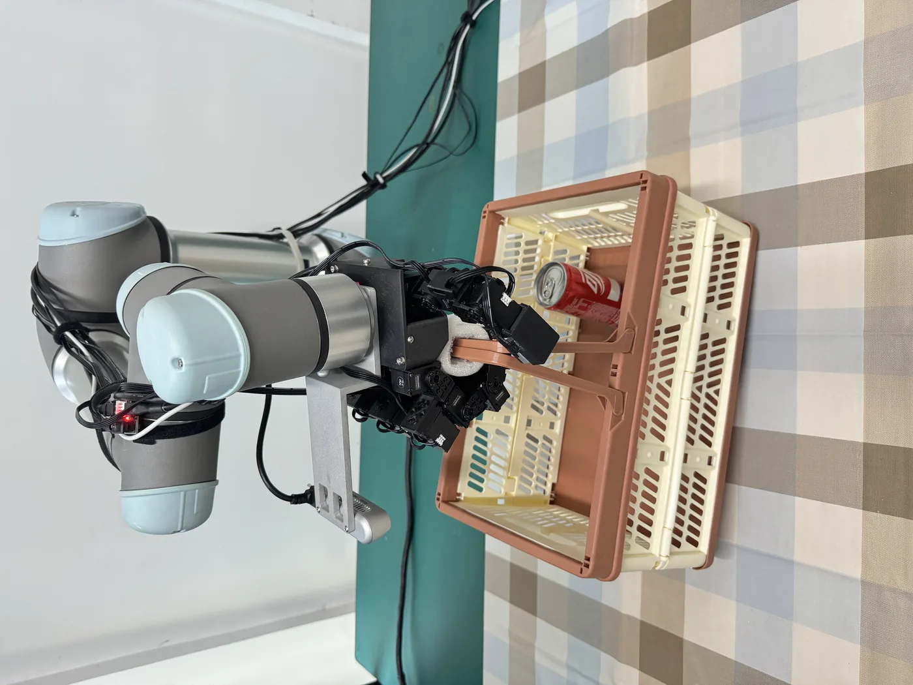
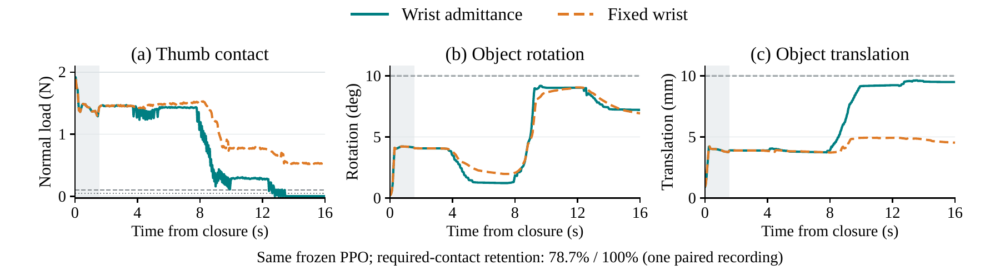

# DynamicDex: Contact-Aware Dexterous Grasping under Hidden Load Shifts

**Anonymous supplementary material for ICRA 2027**

<a href="paper/DynamicDex_ICRA2027_submission.pdf">Paper PDF</a>
&nbsp; · &nbsp;
<a href="#simulation-demos">Simulation demos</a>
&nbsp; · &nbsp;
<a href="#real-world-experiments">Real-world experiments</a>
&nbsp; · &nbsp;
<a href="#data-release">Data release</a>

## Overview

DynamicDex adapts an established dexterous grasp when a payload shifts inside an object. The actor combines tactile descriptors, proprioception, and wrist wrench history, then emits bounded residuals for the 16 hand joints. A privileged critic is used only during training; execution uses onboard observations.

The release contains the paper, the four common-Home simulation recordings used for qualitative inspection, compact trajectory summaries and NPZ trajectories, and the physical Basket sensor captures associated with Fig. 6. Formal controller results and common-Home presentation recordings are kept as separate evidence scopes.

## What the paper establishes

The current paper evaluates 1,395 complete simulation tests across 20 groups.

| Comparison | Result |
| --- | --- |
| Moving load, fixed wrist | DynamicDex: **90/90 (100%)** pose success; fixed grasp: **72/90 (80%)** |
| Basket source of the gain | **30/30** DynamicDex versus **12/30** fixed grasp |
| Mean squared normalized joint torque | **0.0215 vs. 0.0358**, approximately **40% lower** with DynamicDex |
| Moving load, wrist admittance | DynamicDex **84/90 (93.3%)**; fixed grasp **75/90 (83.3%)** |
| Static load | DynamicDex **62/65 (95.4%)**; Grip-4D **63/65**; fixed grasp **61/65** |
| Action/sensing ablations | CoM-Bar/Pan ablations show no consistent success or retention gain within the fixed training budget |

Contact continuity is reported separately from pose success. This distinction is visible in the Pan recordings and in the contact-retention analysis in the paper.

## Method

The method has three linked parts:

1. **Global loading:** wrist wrench and gravity direction provide the resultant load context.
2. **Local contact history:** four finger descriptors are encoded with joint state, roles, and an eight-frame causal history.
3. **Bounded residual execution:** the actor's output is projected through reference, joint-limit, and command-rate bounds before it reaches the LEAP hand.

The paper gives the observation layout, residual map, contact descriptor, reward terms, wrist transformation, admittance configuration, and evaluation definitions in full.

## Simulation demos

The four recordings below start from the same Home scene and open-hand state. Each recording is a presentation trace for one object, separate from the formal 1,395-trial controller matrix.

| Object | Mass | Load motion | Control / duration | Retention in this recording |
| --- | ---: | --- | --- | ---: |
| CoM-Bar | 0.400 kg | slider along x, approximately ±60 mm | wrist admittance + finger load feedback / 16 s | 100.0% |
| Basket | 0.876 kg | payload along x, approximately ±70 mm | wrist admittance + three primary fingers / 16 s | 100.0% |
| Drill | 0.975 kg | fixed internal load | tactile moment feedback / 4.5 s | 100.0% |
| Pan | 0.800 kg | payload along y, approximately ±50 mm | fixed wrist + finger load feedback / 16 s | 78.7% |

### CoM-Bar

[Open the MP4](demos/simulation/com_bar.mp4) · [Trajectory summary](data/simulation/trials/com_bar_summary.json) · [Trajectory NPZ](data/simulation/trials/com_bar_trajectory.npz)

### Basket

[Open the MP4](demos/simulation/basket.mp4) · [Trajectory summary](data/simulation/trials/basket_summary.json) · [Trajectory NPZ](data/simulation/trials/basket_trajectory.npz)

### Drill

[Open the MP4](demos/simulation/drill.mp4) · [Trajectory summary](data/simulation/trials/drill_summary.json) · [Trajectory NPZ](data/simulation/trials/drill_trajectory.npz)

### Pan

[Open the MP4](demos/simulation/pan.mp4) · [Trajectory summary](data/simulation/trials/pan_summary.json) · [Trajectory NPZ](data/simulation/trials/pan_trajectory.npz)

The four-object overview and sensor strips are shown below. The underlying paper figures retain the full resolution and labels.

## Real-world experiments

The physical validation uses the **DynamicDex Full-16 controller with wrist admittance** on a Basket grasp. The author-confirmed aggregate contains 10 static-load and 5 moving-load trials:

| Condition | Success | Mean required-contact retention | Mean peak rotation |
| --- | ---: | ---: | ---: |
| Static load (N=10) | **9/10 (90%)** | **95.0%** | **4.2°** |
| Moving load (N=5) | **4/5 (80%)** | **85.0%** | **8.6°** |

The retention and peak-rotation columns are means of trial-level metrics within each condition. The individual trial logs for this aggregate were not supplied; the aggregate provenance is recorded in the paper project files.

The sensor captures are independent 10-second recordings:

| Capture | Mean tool-frame torque about y (N·m) | Interpretation |
| --- | ---: | --- |
| Initial grasp | −0.620 | loaded grasp reference |
| Payload added | −1.054 | independent loaded capture |
| Payload shifted | −1.146 | independent shifted-load capture |
| No-object reference | −1.285 | post-release reference; not a hardware zero |

Tactile panels show optical marker displacement. They are not calibrated force measurements. Camera and wrist streams were not hardware-synchronized.

The associated photographs show the stages used for the physical response record:

| Before grasp | Initial grasp | Payload added | Payload shifted |
| --- | --- | --- | --- |
|  |  |  |  |

## Data release

- [Simulation metrics CSV](data/simulation/four_common_home_metrics.csv)
- [Simulation release manifest](data/simulation/four_common_home_manifest.json)
- [Simulation-data scope](data/simulation/README.md)
- [Physical 15-trial aggregate](data/physical/basket_trial_aggregates.csv)
- [Physical sensor-capture summary](data/physical/sensor_capture_summary.csv)
- [Physical-data scope](data/physical/README.md)
- [Release manifest with SHA-256 hashes](data/release_manifest.json)

The NPZ files contain the four common-Home presentation trajectories. They do not contain the paper's complete 1,395-trial matrix. The physical aggregate table and the independent sensor-capture table are intentionally separate.

## Figures from the paper

Open the paper figures

## Reproducibility notes

- Simulation physics and control rates in the common-Home recordings are 240 Hz and 24 Hz.
- The policy observation has 123 values and an eight-frame history.
- The actor is evaluated with the same bounded residual map described in the paper.
- The demo recordings use a common Home opening and are tagged as presentation recordings in the accompanying JSON summaries.
- The paper's formal comparisons use frozen checkpoints and paired complete trials; they are not estimated from these four presentation recordings.

This page is an anonymous supplementary material index. The publication PDF is the authoritative source for claims, definitions, and statistical scope.
