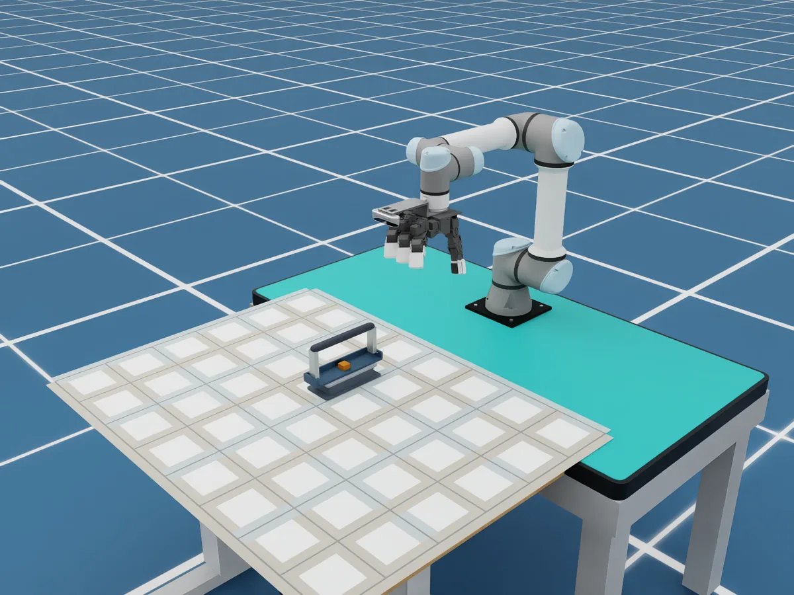
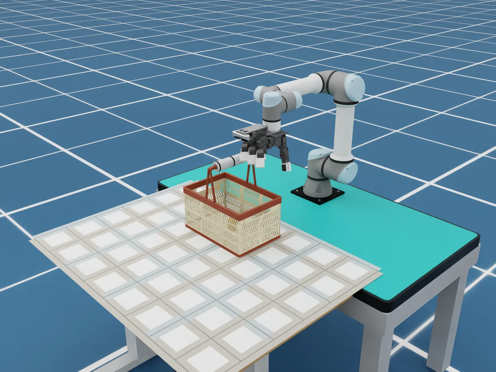
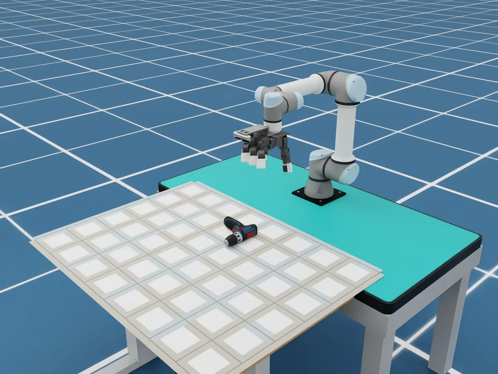
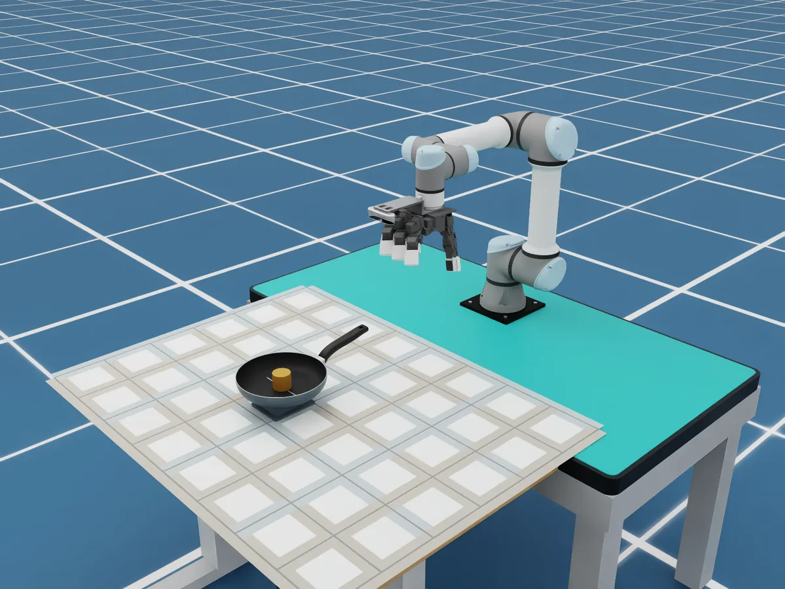
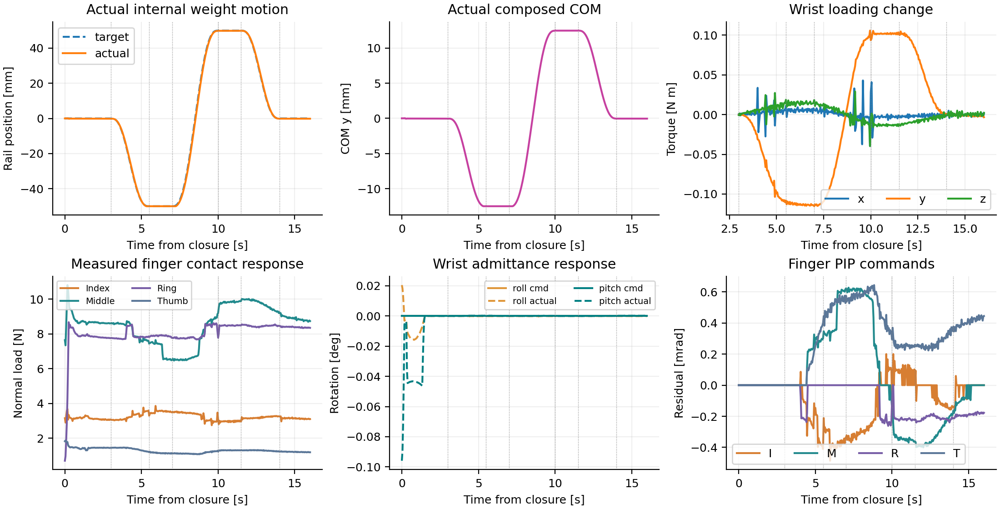

# DynamicDex: Contact-Aware Dexterous Grasping under Hidden Load Shifts

**Anonymous supplementary material · ICRA 2027**

<a href="paper/DynamicDex_ICRA2027_submission.pdf">Paper PDF</a>
&nbsp; · &nbsp;
<a href="#simulation-demos">Simulation demos</a>
&nbsp; · &nbsp;
<a href="#replays">Tactile replays</a>
&nbsp; · &nbsp;
<a href="#real-world">Real-world result</a>

## Key result

DynamicDex uses wrist loading and local tactile history to produce bounded 16-joint residuals around an established grasp. In the paper's 1,395 formal simulation tests, fixed-wrist moving-load pose success increases from **80% (72/90)** with fixed-grasp control to **100% (90/90)**; the mean squared normalized joint torque is **0.0215 vs. 0.0358** (approximately **40% lower**). All 18 additional successes occur on Basket (**30/30 vs. 12/30**).

The physical validation uses **DynamicDex Full-16 with wrist admittance** on Basket: **9/10 static** and **4/5 moving** grasps succeed. Mean required-contact retention is **95%/85%**, and mean peak rotation is **4.2°/8.6°**.

## Simulation demos

These four recordings begin from the same Home scene and are separate common-Home presentation traces, not replacements for the formal controller matrix.

<table>
<tr>
<td width="50%"><b>CoM-Bar</b> <video controls muted playsinline preload="metadata" poster="assets/simulation/com_bar.webp" width="100%"><source src="demos/simulation/com_bar.mp4" type="video/mp4"></video><a href="demos/simulation/com_bar.mp4">Open video</a></td>
<td width="50%"><b>Basket</b> <video controls muted playsinline preload="metadata" poster="assets/simulation/basket.webp" width="100%"><source src="demos/simulation/basket.mp4" type="video/mp4"></video><a href="demos/simulation/basket.mp4">Open video</a></td>
</tr>
<tr>
<td><b>Drill</b> <video controls muted playsinline preload="metadata" poster="assets/simulation/drill.webp" width="100%"><source src="demos/simulation/drill.mp4" type="video/mp4"></video><a href="demos/simulation/drill.mp4">Open video</a></td>
<td><b>Pan</b> <video controls muted playsinline preload="metadata" poster="assets/simulation/pan.webp" width="100%"><source src="demos/simulation/pan.mp4" type="video/mp4"></video><a href="demos/simulation/pan.mp4">Open video</a></td>
</tr>
</table>

| Object | Mass | Payload motion | Controller | Hold retention |
| --- | ---: | --- | --- | ---: |
| CoM-Bar | 0.400 kg | x, about ±60 mm | wrist admittance + finger load feedback | 100.0% |
| Basket | 0.876 kg | x, about ±70 mm | wrist admittance + three primary fingers | 100.0% |
| Drill | 0.975 kg | fixed internal load | tactile moment feedback | 100.0% |
| Pan | 0.800 kg | y, about ±50 mm | fixed wrist + finger load feedback | 78.7% |

## Four-case tactile replays

Each HTML viewer is self-contained: click the play button or move the time slider to update the recorded RGB scene, four optical tactile panels, payload/CoM state, phase, and wrench values. The four viewers use the same common-Home presentation protocol as the videos.

<table>
<tr>
<td width="50%"><b>CoM-Bar</b>  <a href="demos/tactile_replays/com_bar.html">Open real-time tactile replay</a></td>
<td width="50%"><b>Basket</b>  <a href="demos/tactile_replays/basket.html">Open real-time tactile replay</a></td>
</tr>
<tr>
<td><b>Drill</b>  <a href="demos/tactile_replays/drill.html">Open real-time tactile replay</a></td>
<td><b>Pan</b>  <a href="demos/tactile_replays/pan.html">Open real-time tactile replay</a></td>
</tr>
</table>

Tactile images are optical marker/deformation visualizations and are not calibrated force maps. The replays are packet-level engineering/presentation records, separate from the learned-policy formal evaluation.

### Pan overhead-grasp repair

The Pan replay is the verified overhead-handle repair: fixed wrist, finger-load feedback, approximately ±50 mm payload travel, 100% required-contact retention during the hold, 4.57 mm maximum relative translation, and 8.04° maximum rotation. It is a two-run engineering verification, not a learned-policy success-rate estimate.

[Pan repair scope and metrics](data/simulation/pan_overhead_repair.md) · [Pan repair video](demos/pan_overhead_repair/pan_overhead_repair.mp4) · [Pan repair packet report](data/simulation/pan_overhead_repair_report.json)

## Method and paper evidence

The actor combines wrist wrench, gravity direction, proprioception, four local tactile descriptors, role signals, and an eight-frame causal history. Reference, joint-limit, and rate bounds project the 16-joint residual before execution.

## Real-world

The physical platform uses a UR5e, a 16-joint LEAP hand, four GelSight Mini sensors, and wrist wrench sensing. The independent 10-second sensor captures associated with Fig. 6 show uncompensated tool-frame mean torque about y of **−0.620**, **−1.054**, and **−1.146 N·m** at the initial, loaded, and shifted-load captures. Optical marker motion is a deformation visualization, not a calibrated contact force.

| Condition | Success | Mean contact retention | Mean peak rotation |
| --- | ---: | ---: | ---: |
| Static load (N=10) | **9/10 (90%)** | **95.0%** | **4.2°** |
| Moving load (N=5) | **4/5 (80%)** | **85.0%** | **8.6°** |

## Data

- [Paper PDF](paper/DynamicDex_ICRA2027_submission.pdf)
- [Simulation metrics](data/simulation/four_common_home_metrics.csv) · [trajectory summaries](data/simulation/trials/) · [release manifest](data/release_manifest.json)
- [Pan repair report](data/simulation/pan_overhead_repair_report.json) · [Pan replay scope](data/simulation/pan_overhead_repair.md)
- [Physical 15-trial aggregate](data/physical/basket_trial_aggregates.csv)
- [Independent sensor-capture summary](data/physical/sensor_capture_summary.csv)

The 15-trial physical aggregate and the independent sensor captures are separate evidence sets. Individual logs for the aggregate were not supplied; the table reports the author-confirmed group means.
