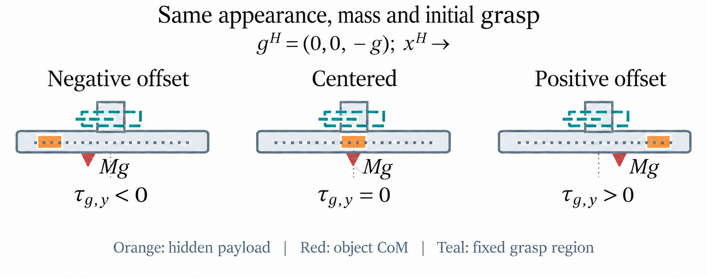
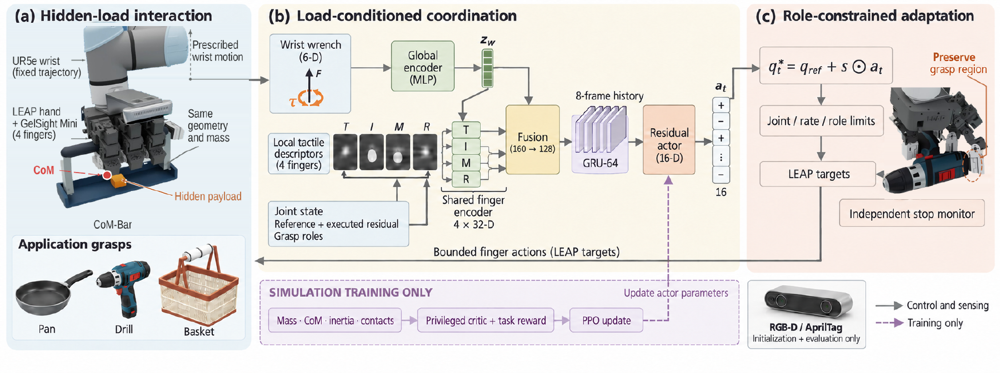
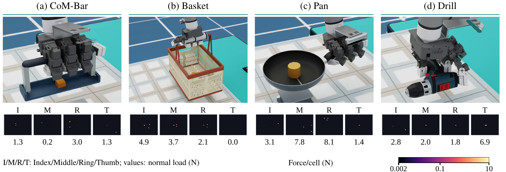
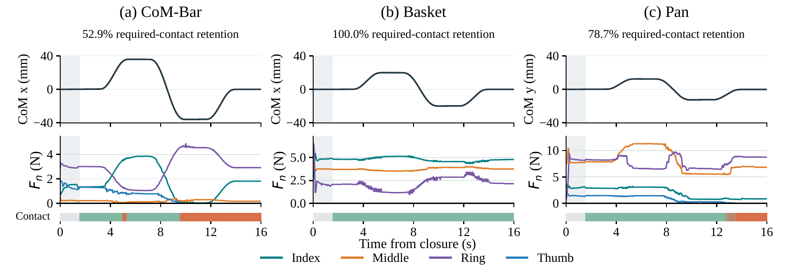
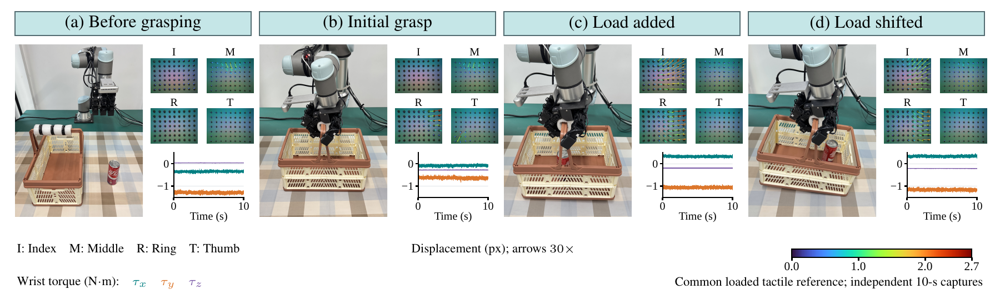

# DynamicDex: Contact-Aware Dexterous Grasping under Hidden Load Shifts

**Anonymous supplementary material · ICRA 2027**

<a href="paper/DynamicDex_ICRA2027_submission.pdf">Paper PDF</a>
&nbsp; · &nbsp;
<a href="demos/simulation/com_bar.mp4">Videos</a>
&nbsp; · &nbsp;
<a href="data/release_manifest.json">Data manifest</a>

## Abstract

Hidden mass redistribution changes the support required from a dexterous grasp even when object geometry and total mass remain unchanged. DynamicDex combines global wrist loading with local tactile history to generate bounded residuals around an established grasp. With a fixed wrist, moving-load pose success increases from **80% to 100%**, and mean squared normalized joint torque is approximately **40% lower** than fixed-grasp control. Physical Basket grasps achieve **90% static-load** and **80% moving-load** success. Contact continuity is reported separately from pose recovery.

## Method Overview

DynamicDex encodes wrist wrench and gravity globally, combines four local tactile descriptors with proprioception and role signals, and processes an eight-frame causal history. The actor produces 16 joint residuals that are projected through reference, joint-limit, and rate bounds. A privileged critic is used only during training.

## Simulation Results

The paper reports **1,395 complete tests across 20 groups**.

| Comparison | Result |
| --- | --- |
| Moving load, fixed wrist | DynamicDex **90/90 (100%)**; fixed grasp **72/90 (80%)** |
| Basket source of the gain | **30/30** DynamicDex versus **12/30** fixed grasp |
| Mean squared normalized joint torque | **0.0215 vs. 0.0358**, approximately **40% lower** |
| Moving load, wrist admittance | DynamicDex **84/90 (93.3%)**; fixed grasp **75/90 (83.3%)** |
| Static load | DynamicDex **62/65**; Grip-4D **63/65**; fixed grasp **61/65** |
| Ablations | No consistent success or retention gain within the fixed training budget |

The following four recordings begin from the same Home scene. They are presentation traces separate from the formal controller matrix.

| Object | Mass | Payload motion | Video |
| --- | ---: | --- | --- |
| CoM-Bar | 0.400 kg | x, about ±60 mm | [MP4](demos/simulation/com_bar.mp4) |
| Basket | 0.876 kg | x, about ±70 mm | [MP4](demos/simulation/basket.mp4) |
| Drill | 0.975 kg | fixed internal load | [MP4](demos/simulation/drill.mp4) |
| Pan | 0.800 kg | y, about ±50 mm | [MP4](demos/simulation/pan.mp4) |

## Four-Case Tactile Replays

Each viewer plays the same high-resolution synchronized video on GitHub Pages and in the anonymous repository. The scene, four tactile panels, and contact traces can be paused, scrubbed, and viewed full screen. Optional phase navigation and recorded measurements appear below the player when scripts are enabled. Tactile images are simulated marker/deformation displays, not calibrated force maps.

| Case | Replay |
| --- | --- |
| CoM-Bar | [Open tactile replay](https://anonymous.4open.science/r/ICRA2027-DynamicDex-12D6/demos/tactile_replays/com_bar.html) · [MP4](https://anonymous.4open.science/r/ICRA2027-DynamicDex-12D6/demos/simulation/com_bar.mp4) |
| Basket | [Open tactile replay](https://anonymous.4open.science/r/ICRA2027-DynamicDex-12D6/demos/tactile_replays/basket.html) · [MP4](https://anonymous.4open.science/r/ICRA2027-DynamicDex-12D6/demos/simulation/basket.mp4) |
| Drill | [Open tactile replay](https://anonymous.4open.science/r/ICRA2027-DynamicDex-12D6/demos/tactile_replays/drill.html) · [MP4](https://anonymous.4open.science/r/ICRA2027-DynamicDex-12D6/demos/simulation/drill.mp4) |
| Pan | [Open tactile replay](https://anonymous.4open.science/r/ICRA2027-DynamicDex-12D6/demos/tactile_replays/pan.html) · [MP4](https://anonymous.4open.science/r/ICRA2027-DynamicDex-12D6/demos/simulation/pan.mp4) |

The Pan link above is the regular Pan replay. The separate **Pan non-PPO engineering grasp** is available in [its video](demos/pan_overhead_repair/pan_overhead_repair.mp4), [its packet report](data/simulation/pan_overhead_repair_report.json), and [its scope note](data/simulation/pan_overhead_repair.md).

## Real-World Results

Physical validation uses DynamicDex Full-16 with wrist admittance on Basket. Contact retention and peak rotation are means of trial-level metrics within each condition.

| Condition | Success | Mean contact retention | Mean peak rotation |
| --- | ---: | ---: | ---: |
| Static load (N=10) | **9/10 (90%)** | **95.0%** | **4.2°** |
| Moving load (N=5) | **4/5 (80%)** | **85.0%** | **8.6°** |

The independent sensor captures report uncompensated tool-frame y-axis torque of **−0.620**, **−1.054**, and **−1.146 N·m** across initial, loaded, and shifted-load states. Optical marker motion is a deformation visualization, not a calibrated force measurement. The 15-trial aggregate and the independent sensor captures are separate evidence sets.

## Paper and Data

- [Paper PDF](paper/DynamicDex_ICRA2027_submission.pdf)
- [Simulation metrics](data/simulation/four_common_home_metrics.csv)
- [Simulation trajectory summaries](data/simulation/trials/)
- [Physical 15-trial aggregate](data/physical/basket_trial_aggregates.csv)
- [Independent sensor-capture summary](data/physical/sensor_capture_summary.csv)
- [Release manifest with SHA-256 hashes](data/release_manifest.json)
